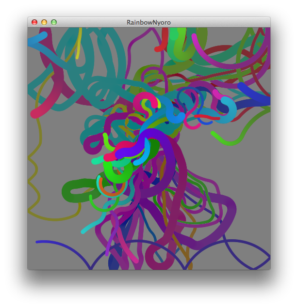

Processing-RainbowNyoro
=======================

カラフルなにょろにょろがマウスポインタのそばに寄ってきてくるくる回ったりします。クリックするとリセットがかかります。

###実行方法

Processingの開発環境をインストールし、pdeファイルを読み込んでRunボタンを押す。
上下左右キーで自機を操作します。

または以下のリンクからブラウザでも実行できます。JavaScriptで動作します。

[Rainbow Nyoro](http://muratamuu.github.io/Processing-RainbowNyoro/index.html)
